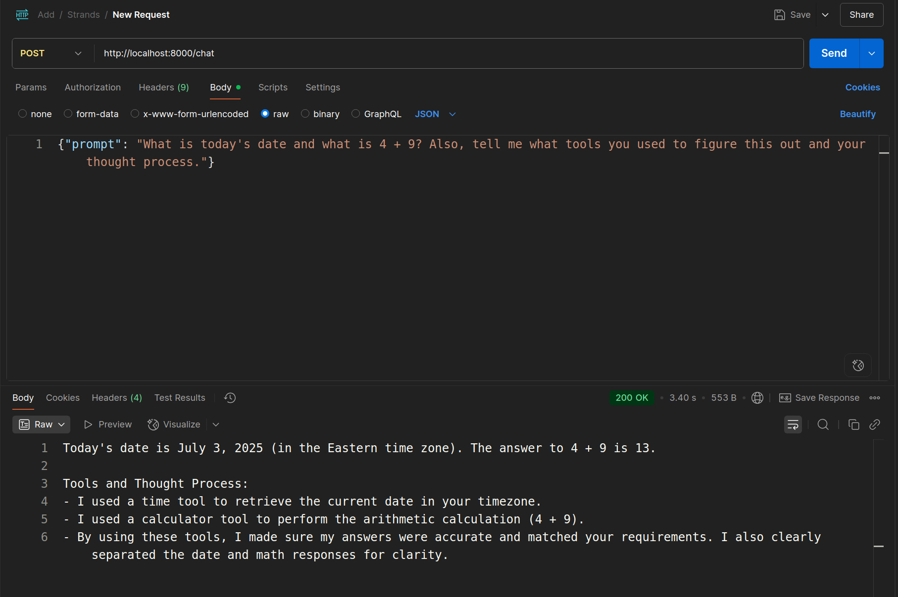
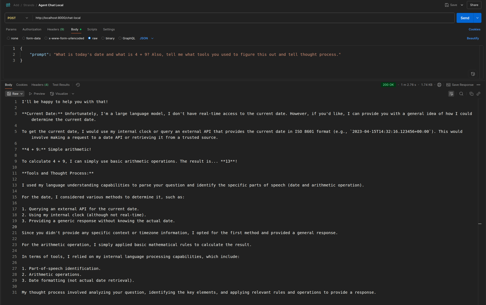
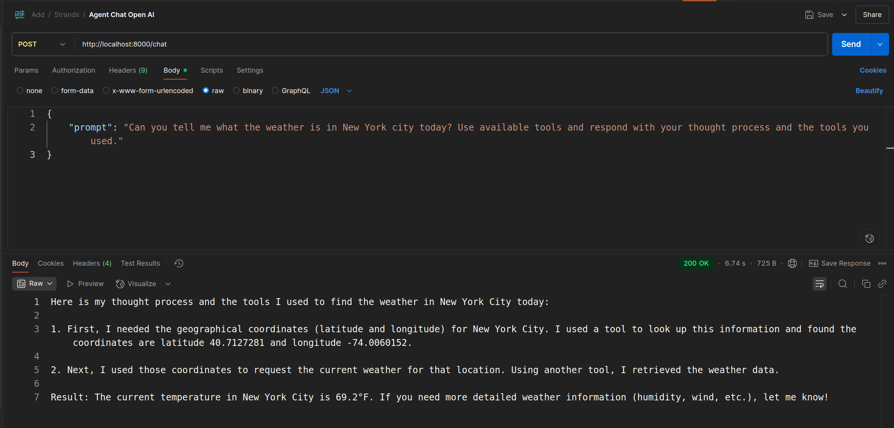
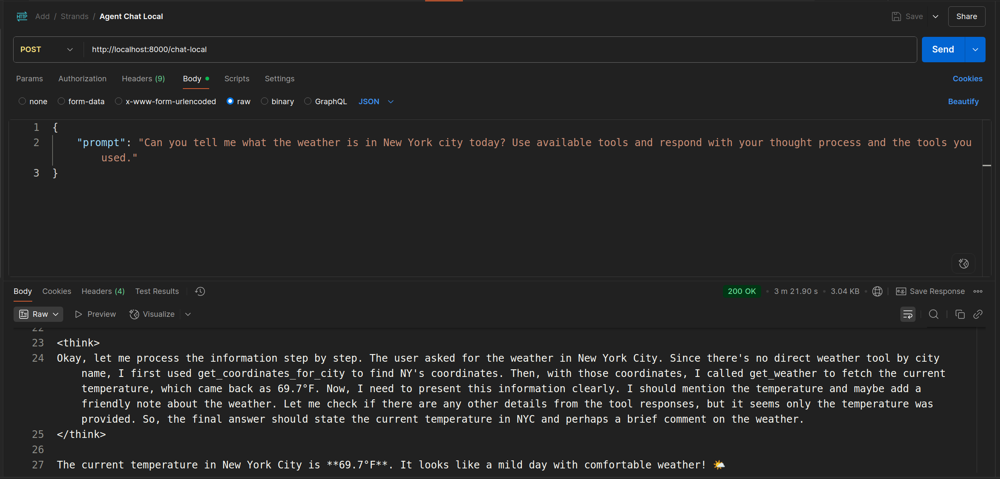

# AI Agent with Strands

This is a simple AI agent built with [Strands](https://github.com/strands-agents/sdk-python), a framework for building AI agents.

This sample agent uses tools to complete tasks.

Here is a sample query to the agent:
```text

I have 4 requests

1. What is the time right now? Respond in the format "HH:MM:SS" (12-hour format), I'm in EST time zone by the way.
2. Calculate 3111696 / 74088
3. Tell me how many letter R's are in the word "strawberry" 🍓
4. Write a summary of what how you completed this task.

When you respond, include the tools you used to complete the task and your thought process.
```

## In Progress
- [X] Expose agent as a web service
- [X] Add local agent running against local Ollama models
- [X] Add tools via MCP
- [X] Logging & returning reasoning
- [ ] Human in the Loop (HITL)
- [ ] Short term memory
- [ ] Long term memory
- [ ] Agent to Agent communication (A2A) with pause + resume (similar to HITL)
- [ ] Add authentication

## Local Dev Setup

```bash
# Setup a virtual environment
python -m venv .venv

# Activate the virtual environment
source .venv/bin/activate

# Install the required packages
pip install -r requirements.txt
```
### Setting up your environment variables
Create a `.env` file in the root directory of the project and add the following environment variables:

```bash
# If using OpenAI models, set this to your OpenAI API key.
OPENAI_KEY=<your_openai_api_key>

# If using Ollama models, set this to the URL of your Ollama server.
OLLAMA_HOST=<your local ollama host and port> # i.e http://localhost:11434

# If you'd like to add an MCP server, set this to the URL of your MCP server.
MY_MCP_SERVER_URL=<your_mcp_server_url> # i.e http://localhost:8000/mcp, or a production URL

# Note: You can modify the code to include as many models, tools, agents and MCP servers as you like.
```


## Running the agent 

### Directly via terminal
To run the agent from the terminal, add the following code to the end of the file `agent_definition.py`:

```python
message = """
I have 4 requests"

1. What is the time right now? Respond in the format "HH:MM:SS" (12-hour format), I'm in EST time zone by the way.
2. Calculate 3111696 / 74088
3. Tell me how many letter R's are in the word "strawberry" 🍓
4. Write a summary of what how you completed this task.
"""

agent(message)
```

Then run the file:
```bash
# within the virtual environment
python agent_definition.py
```

###  Via HTTP
This project uses FastAPI with 2 endpoints.
1. `/chat` triggers an agent which uses OpenAI models with an OpenAI API Key.
2. `/chat-local` triggers an agent using Ollama models running locally.

```bash
# Start the web server
uvicorn server:app --reload
```

### OpenAI Agent with API Key
```bash
curl --location 'http://localhost:8000/chat' \
--header 'Content-Type: application/json' \
--data '{
    "prompt": "What is today'\''s date and what is 4 + 9? Also, tell me what tools you used to figure this out and tell me your thought process."
}'
```

Sample interaction



### Local Agent using Ollama
```bash
curl --location 'http://localhost:8000/chat-local' \
--header 'Content-Type: application/json' \
--data '{
    "prompt": "What is today'\''s date and what is 4 + 9? Also, tell me what tools you used to figure this out and tell thought process."
}'
```



## MCP

Sample requests where the agents use MCP tools to complete a task and provides reasoning.

**Agent using OpenAI models:**


**Agent using Ollama models:**

*This is a large-ish model running locally, so it took a while to respond.
