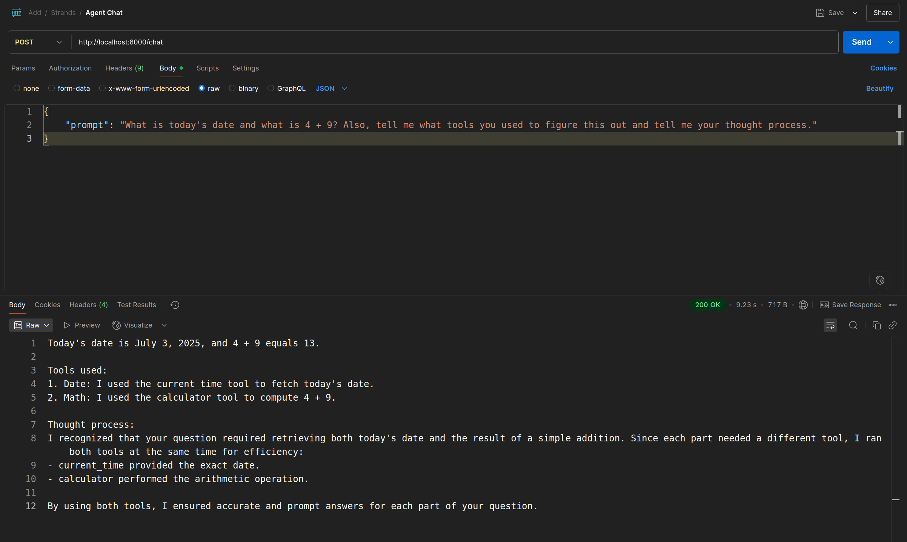

# AI Agent with Strands

This is a simple AI agent built with [Strands](https://github.com/strands-agents/sdk-python), a framework for building AI agents.

This sample agent uses tools to complete tasks.

## In Progress
- [X] Expose agent as a web service
- [ ] Human in the Loop (HITL)
- [ ] Short term memory
- [ ] Long term memory
- [ ] Logging reasoning
- [ ] Add MCP
- [ ] Agent to Agent communication (A2A) with pause + resume
- [ ] Add authentication


## Setup the .venv and install dependencies

```bash
python -m venv .venv

source .venv/bin/activate

pip install -r requirements.txt
```

## Run the agent directly via terminal
```bash
# within the virtual environment
python agent_definition.py
```

## Interacting with the agent via HTTP
```bash
# Start the web server
uvicorn server:app --reload
```

```bash
# Sample curl request to the agent
curl --location 'http://localhost:8000/chat' \
--header 'Content-Type: application/json' \
--data '{
    "prompt": "What is today'\''s date and what is 4 + 9? Also, tell me what tools you used to figure this out and tell me your thought process."
}'
```

Sample interaction

